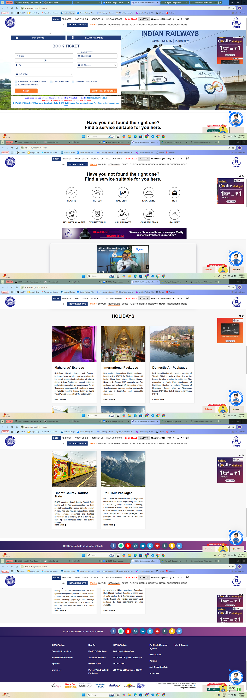
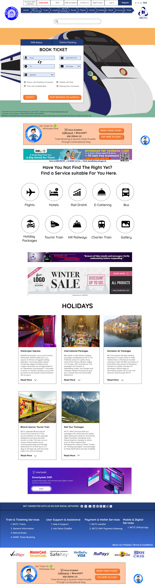

# IRCTC Landing Page Redesign ✨

Redesigned as part of **Internship Task-1 for CodTech**, this project focuses on enhancing both the **usability and aesthetics** of the existing IRCTC landing page.

---

## 🧠 Task Brief
**Objective:**  
Redesign an existing website landing page to improve **usability** and **visual appeal**.

**Deliverables:**  
- Before and after visuals  
- Brief explanation of design decisions

  ## 📌 Selected Website
**IRCTC – Indian Railway Catering and Tourism Corporation**  
🔗 [https://www.irctc.co.in](https://www.irctc.co.in)

### Why IRCTC?
- ✅ **High Impact**: A platform used by millions daily
- ✅ **Terrible UX/UI**: Cluttered, ad-heavy, and confusing layout

---

## 📸 Before vs After

### 🔴 Original Design

The original IRCTC website is cluttered, visually overwhelming, and has no clear visual hierarchy. Important actions like booking tickets get buried in layers of distractions, banners, and text. Navigation isn't intuitive, and excessive visual noise makes usability harder for users of all ages.

---

### 🟢 Redesigned Version

---

## 📝 Design Decisions (Brief)

The redesigned IRCTC landing page focuses on **streamlining the user experience** by eliminating clutter and establishing a clear visual hierarchy. The **primary user task—booking tickets—is made the focal point**, reducing cognitive load for first-time and frequent users alike. Key sections such as *Plan My Journey*, *PNR Status*, and *Holiday Packages* are grouped logically, making navigation intuitive.

The **color scheme is softened** to avoid overwhelming the eye, while essential buttons and CTAs are given prominence with accent colors. Ads and unrelated content have been removed or minimized to **focus user attention** on important actions.

By adopting a **minimalist and modular layout**, the design not only improves usability but also aligns with modern UI trends—making it more accessible, responsive, and visually appealing for a broad range of users.

---

## ✨ Brief Description of the Redesign Decisions

| Feature | Original | Redesigned |
|--------|----------|------------|
| **Main Call-to-Action (CTA)** | Cluttered around visuals and buttons | Clear & Central |
| **Layout** | Dense and unstructured | Clean, modular, and structured |
| **Visual Noise** | Ads, banners, multiple colors | Focused and minimal |
| **Service Access** | Scattered links | Organized into categories |
| **Trust & Modern Feel** | Outdated design | Sleek and professional |

### Key Improvements
- **Decluttered Interface**: Removed overwhelming banner ads and popups that hinder user experience.
- **Navigation Overhaul**: Introduced a simple, intuitive nav bar with home access and key links always visible.
- **Search Functionality**: Added a search bar to improve accessibility and allow quick user queries.
- **Focused Landing Area**: Reduced distractions by emphasizing core booking flow, visible CTA, and a neat visual structure.
- **Consistent Layout**: Standardized card layouts for different services like ticket booking, tourist packages, and login info.
- **Visual Hierarchy**: Clear typography, button styling, and use of white space to highlight important tasks.

These changes aim to drastically reduce confusion and improve satisfaction, particularly for users with limited digital literacy or time.

---

## 🎯 UX and UI Goals

- **Improved Visual Hierarchy:**  
  Clearer segmentation of key areas (ticket booking, services, holidays, etc.)

- **Simplified Booking Section:**  
  Booking a train is the primary CTA—this is made prominent and accessible immediately.

- **Modernized Aesthetic:**  
  Smoother typography, spacing, and iconography enhance readability and make the page feel more trustworthy.

- **Responsive & Inclusive Design:**  
  Considered users of all ages by improving contrast, readability, and touch-friendly interactions.

---

## 🔍 Design Enhancements

| Feature | Original | Redesigned |
|--------|----------|------------|
| **Main Call-to-Action (CTA)** | Cluttered around visuals and buttons | Clear & Central |
| **Layout** | Dense and unstructured | Clean, modular, and structured |
| **Visual Noise** | Ads, banners, multiple colors | Focused and minimal |
| **Service Access** | Scattered links | Organized into categories |
| **Trust & Modern Feel** | Outdated design | Sleek and professional |

---

## 🛠️ Tools Used

- Figma (for wireframing + UI design)
- Adobe Illustrator (icon styling)
- Color contrast checkers
- Google Fonts (for better typography)

---

## 📝 About the Designer

👩‍🎨 *Vani Kothari*  
Aspiring UI/UX designer passionate about intuitive experiences, storytelling through design, and making digital platforms feel human-friendly.

---

## 📎 Credits

- Original design by **IRCTC**
- Redesign for educational purposes only (as part of CodTech Internship Task 1)

---

> Thank you for reviewing this redesign! Feedback is always welcome 😊

